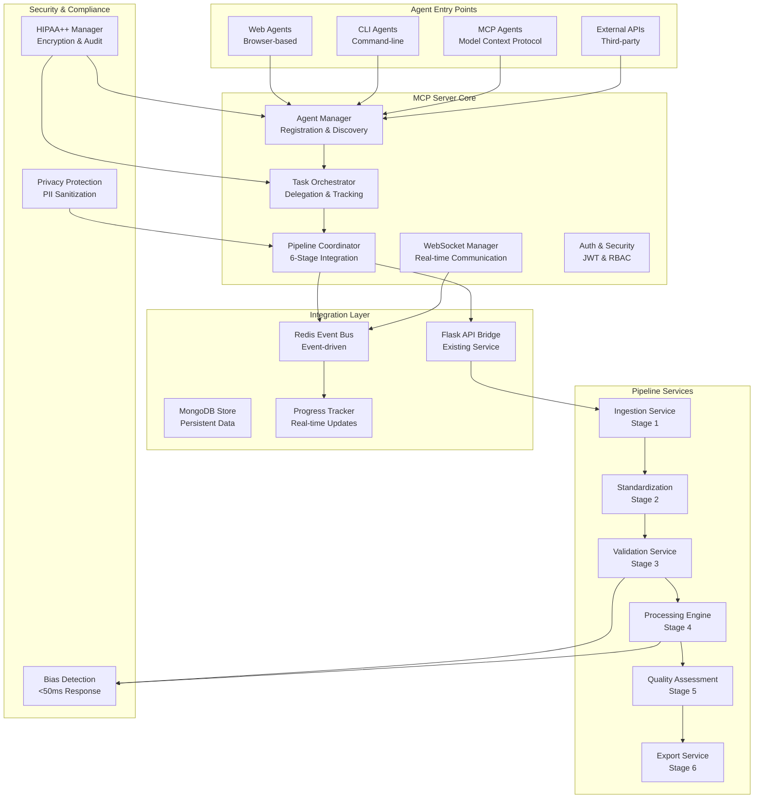
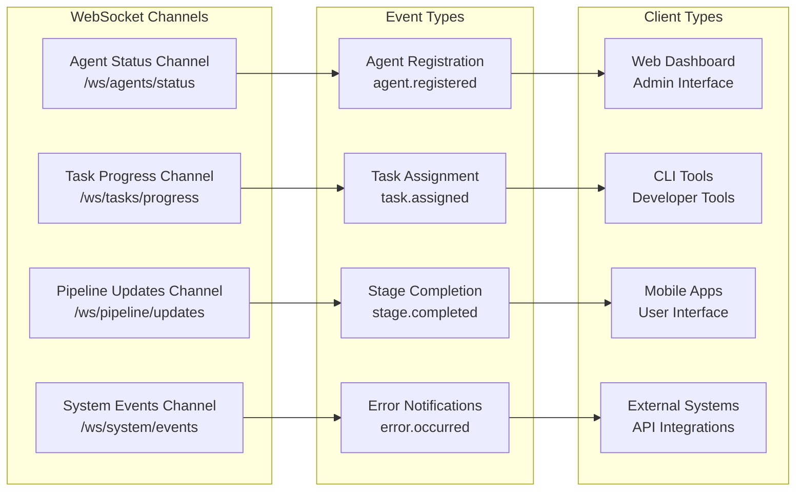

# 🏛️ MCP (Management Control Panel) Server Architecture

## Executive Summary

The MCP server serves as the central orchestration hub for agent interactions in the TechDeck-Python pipeline integration, providing comprehensive agent management, task delegation, and real-time communication capabilities while maintaining HIPAA++ compliance and sub-50ms performance targets.

## 🎯 System Architecture Overview

### High-Level Architecture


## 🏗️ Core Component Architecture

### 1. Agent Management System
```mermaid
graph LR
    subgraph "Agent Lifecycle"
        A[Agent Registration<br/>POST /api/v1/agents/register]
        B[Agent Discovery<br/>GET /api/v1/agents/discover]
        C[Agent Health Check<br/>GET /api/v1/agents/{id}/health]
        D[Agent Deregistration<br/>DELETE /api/v1/agents/{id}]
    end
    
    subgraph "Agent Capabilities"
        E[Capability Registration<br/>POST /api/v1/agents/{id}/capabilities]
        F[Skill Validation<br/>POST /api/v1/agents/{id}/validate]
        G[Performance Metrics<br/>GET /api/v1/agents/{id}/metrics]
        H[Resource Allocation<br/>POST /api/v1/agents/{id}/allocate]
    end
    
    subgraph "Agent Types"
        I[AI Models<br/>Therapeutic Agents]
        J[Data Processors<br/>Pipeline Agents]
        K[Validation Agents<br/>Quality Agents]
        L[External APIs<br/>Third-party Agents]
    end
    
    A --> E
    B --> F
    C --> G
    D --> H
    E --> I
    F --> J
    G --> K
    H --> L
```

### 2. Task Delegation & Orchestration
```mermaid
graph TD
    subgraph "Task Lifecycle"
        A[Task Creation<br/>POST /api/v1/tasks]
        B[Task Assignment<br/>POST /api/v1/tasks/{id}/assign]
        C[Task Execution<br/>WebSocket /ws/tasks/{id}]
        D[Task Completion<br/>POST /api/v1/tasks/{id}/complete]
        E[Task Monitoring<br/>GET /api/v1/tasks/{id}/status]
    end
    
    subgraph "Task Types"
        F[Pipeline Tasks<br/>6-Stage Processing]
        G[Validation Tasks<br/>Bias Detection]
        H[Analysis Tasks<br/>Therapeutic Analysis]
        I[Export Tasks<br/>Multi-format Output]
    end
    
    subgraph "Task Priority"
        J[Critical<br/>Real-time]
        K[High<br/>User-facing]
        L[Medium<br/>Background]
        M[Low<br/>Batch Processing]
    end
    
    A --> F
    B --> G
    C --> H
    D --> I
    F --> J
    G --> K
    H --> L
    I --> M
```

### 3. Real-time Communication Architecture


## 🔧 Technical Implementation

### MCP Server Core Components

#### Agent Manager
```python
class AgentManager:
    """Manage agent registration, discovery, and lifecycle"""
    
    def __init__(self, redis_client: RedisClient, mongodb_client: MongoClient):
        self.redis = redis_client
        self.mongodb = mongodb_client
        self.agent_registry = AgentRegistry()
        self.health_checker = AgentHealthChecker()
        self.capability_validator = CapabilityValidator()
    
    async def register_agent(self, agent_data: AgentRegistrationData) -> Agent:
        """Register new agent with capability validation"""
        # Validate agent capabilities
        validated_capabilities = await self.capability_validator.validate(
            agent_data.capabilities
        )
        
        # Create agent instance
        agent = Agent(
            id=generate_uuid(),
            name=agent_data.name,
            type=agent_data.type,
            capabilities=validated_capabilities,
            status=AgentStatus.ACTIVE,
            registered_at=datetime.utcnow()
        )
        
        # Store in registry
        await self.agent_registry.add_agent(agent)
        
        # Publish registration event
        await self.publish_event('agent.registered', agent.to_dict())
        
        return agent
    
    async def discover_agents(self, criteria: AgentDiscoveryCriteria) -> List[Agent]:
        """Discover agents based on capability criteria"""
        return await self.agent_registry.find_agents(criteria)
    
    async def update_agent_status(self, agent_id: str, status: AgentStatus) -> bool:
        """Update agent status and health metrics"""
        agent = await self.agent_registry.get_agent(agent_id)
        if not agent:
            return False
        
        agent.status = status
        agent.last_seen = datetime.utcnow()
        
        await self.agent_registry.update_agent(agent)
        
        # Publish status update
        await self.publish_event('agent.status_updated', {
            'agent_id': agent_id,
            'status': status.value
        })
        
        return True
```

#### Task Orchestrator
```python
class TaskOrchestrator:
    """Orchestrate task delegation and execution across agents"""
    
    def __init__(self, agent_manager: AgentManager, pipeline_coordinator: PipelineCoordinator):
        self.agent_manager = agent_manager
        self.pipeline_coordinator = pipeline_coordinator
        self.task_queue = TaskQueue()
        self.task_assigner = TaskAssigner()
        self.progress_tracker = ProgressTracker()
    
    async def create_task(self, task_data: TaskCreationData) -> Task:
        """Create new task with validation and initial setup"""
        # Validate task requirements
        validated_requirements = await self.validate_task_requirements(task_data)
        
        # Create task instance
        task = Task(
            id=generate_uuid(),
            type=task_data.type,
            priority=task_data.priority,
            requirements=validated_requirements,
            status=TaskStatus.PENDING,
            created_at=datetime.utcnow()
        )
        
        # Store task
        await self.task_queue.add_task(task)
        
        # Publish task creation event
        await self.publish_event('task.created', task.to_dict())
        
        return task
    
    async def assign_task(self, task_id: str, agent_criteria: AgentCriteria) -> TaskAssignment:
        """Assign task to suitable agent based on criteria"""
        # Get available agents
        suitable_agents = await self.agent_manager.discover_agents(agent_criteria)
        
        if not suitable_agents:
            raise NoSuitableAgentError("No agents available for task requirements")
        
        # Select best agent based on load balancing and capabilities
        selected_agent = await self.task_assigner.select_agent(suitable_agents, task_id)
        
        # Create assignment
        assignment = TaskAssignment(
            task_id=task_id,
            agent_id=selected_agent.id,
            assigned_at=datetime.utcnow(),
            status=AssignmentStatus.ASSIGNED
        )
        
        # Update task status
        await self.update_task_status(task_id, TaskStatus.ASSIGNED)
        
        # Publish assignment event
        await self.publish_event('task.assigned', assignment.to_dict())
        
        return assignment
    
    async def execute_task(self, task_id: str, execution_data: ExecutionData) -> ExecutionResult:
        """Execute task through assigned agent with progress tracking"""
        # Get task and assignment
        task = await self.task_queue.get_task(task_id)
        assignment = await self.get_task_assignment(task_id)
        
        if not assignment or assignment.status != AssignmentStatus.ASSIGNED:
            raise TaskNotAssignedError("Task is not properly assigned")
        
        # Initialize progress tracking
        progress_id = await self.progress_tracker.initialize_progress(task_id)
        
        try:
            # Execute based on task type
            if task.type == TaskType.PIPELINE_PROCESSING:
                result = await self.execute_pipeline_task(task, execution_data)
            elif task.type == TaskType.BIAS_DETECTION:
                result = await self.execute_bias_detection_task(task, execution_data)
            elif task.type == TaskType.VALIDATION:
                result = await self.execute_validation_task(task, execution_data)
            else:
                result = await self.execute_generic_task(task, execution_data)
            
            # Update task status
            await self.update_task_status(task_id, TaskStatus.COMPLETED)
            
            # Finalize progress
            await self.progress_tracker.complete_progress(progress_id)
            
            return result
            
        except Exception as e:
            # Handle execution errors
            await self.handle_task_execution_error(task_id, e)
            raise
```

#### Pipeline Integration
```python
class PipelineIntegrationManager:
    """Integrate MCP server with existing 6-stage pipeline"""
    
    def __init__(self, pipeline_coordinator: PipelineCoordinator, task_orchestrator: TaskOrchestrator):
        self.pipeline_coordinator = pipeline_coordinator
        self.task_orchestrator = task_orchestrator
        self.stage_mapping = self._initialize_stage_mapping()
    
    async def execute_pipeline_with_agents(self, pipeline_request: PipelineRequest) -> PipelineResult:
        """Execute 6-stage pipeline using agent orchestration"""
        execution_id = generate_uuid()
        
        try:
            # Stage 1: Ingestion
            ingestion_task = await self.create_stage_task(
                execution_id, PipelineStage.INGESTION, pipeline_request
            )
            ingestion_result = await self.execute_stage_task(ingestion_task)
            
            # Stage 2: Standardization
            standardization_task = await self.create_stage_task(
                execution_id, PipelineStage.STANDARDIZATION, ingestion_result
            )
            standardization_result = await self.execute_stage_task(standardization_task)
            
            # Stage 3: Validation (with bias detection)
            validation_task = await self.create_stage_task(
                execution_id, PipelineStage.VALIDATION, standardization_result
            )
            validation_result = await self.execute_stage_task(validation_task)
            
            # Stage 4: Processing
            processing_task = await self.create_stage_task(
                execution_id, PipelineStage.PROCESSING, validation_result
            )
            processing_result = await self.execute_stage_task(processing_task)
            
            # Stage 5: Quality Assessment
            quality_task = await self.create_stage_task(
                execution_id, PipelineStage.QUALITY_ASSESSMENT, processing_result
            )
            quality_result = await self.execute_stage_task(quality_task)
            
            # Stage 6: Export
            export_task = await self.create_stage_task(
                execution_id, PipelineStage.EXPORT, quality_result
            )
            export_result = await self.execute_stage_task(export_task)
            
            return PipelineResult(
                execution_id=execution_id,
                status=PipelineStatus.COMPLETED,
                results=export_result,
                metrics=self.calculate_pipeline_metrics(execution_id)
            )
            
        except Exception as e:
            return await self.handle_pipeline_failure(execution_id, e)
    
    async def create_stage_task(self, execution_id: str, stage: PipelineStage, input_data: Any) -> Task:
        """Create task for specific pipeline stage"""
        task_data = TaskCreationData(
            type=TaskType.PIPELINE_PROCESSING,
            priority=TaskPriority.HIGH,
            requirements={
                'stage': stage.value,
                'execution_id': execution_id,
                'input_data': input_data,
                'capabilities': self.get_required_capabilities(stage)
            }
        )
        
        return await self.task_orchestrator.create_task(task_data)
```

### API Endpoints

#### Agent Management Endpoints
```python
# Agent Registration
@app.route('/api/v1/agents/register', methods=['POST'])
@authenticate
@validate_request(AgentRegistrationSchema)
def register_agent():
    """Register new agent with the MCP server"""
    agent_data = AgentRegistrationData(**request.json)
    agent = agent_manager.register_agent(agent_data)
    return jsonify({
        'success': True,
        'data': agent.to_dict(),
        'message': 'Agent registered successfully'
    })

# Agent Discovery
@app.route('/api/v1/agents/discover', methods=['GET'])
@authenticate
def discover_agents():
    """Discover agents based on capability criteria"""
    criteria = AgentDiscoveryCriteria.from_request(request.args)
    agents = agent_manager.discover_agents(criteria)
    return jsonify({
        'success': True,
        'data': [agent.to_dict() for agent in agents],
        'count': len(agents)
    })

# Agent Health Check
@app.route('/api/v1/agents/<agent_id>/health', methods=['GET'])
@authenticate
def check_agent_health(agent_id: str):
    """Check agent health status"""
    health_status = agent_manager.check_agent_health(agent_id)
    return jsonify({
        'success': True,
        'data': health_status
    })
```

#### Task Management Endpoints
```python
# Task Creation
@app.route('/api/v1/tasks', methods=['POST'])
@authenticate
@validate_request(TaskCreationSchema)
def create_task():
    """Create new task for agent execution"""
    task_data = TaskCreationData(**request.json)
    task = task_orchestrator.create_task(task_data)
    return jsonify({
        'success': True,
        'data': task.to_dict(),
        'message': 'Task created successfully'
    })

# Task Assignment
@app.route('/api/v1/tasks/<task_id>/assign', methods=['POST'])
@authenticate
@validate_request(TaskAssignmentSchema)
def assign_task(task_id: str):
    """Assign task to suitable agent"""
    assignment_data = TaskAssignmentData(**request.json)
    assignment = task_orchestrator.assign_task(task_id, assignment_data.criteria)
    return jsonify({
        'success': True,
        'data': assignment.to_dict(),
        'message': 'Task assigned successfully'
    })

# Task Status
@app.route('/api/v1/tasks/<task_id>/status', methods=['GET'])
@authenticate
def get_task_status(task_id: str):
    """Get current task status and progress"""
    status = task_orchestrator.get_task_status(task_id)
    return jsonify({
        'success': True,
        'data': status
    })
```

#### Pipeline Integration Endpoints
```python
# Pipeline Execution with Agents
@app.route('/api/v1/pipeline/agent-execute', methods=['POST'])
@authenticate
@validate_request(PipelineExecutionSchema)
def execute_pipeline_with_agents():
    """Execute 6-stage pipeline using agent orchestration"""
    pipeline_request = PipelineRequest(**request.json)
    result = pipeline_integration_manager.execute_pipeline_with_agents(pipeline_request)
    return jsonify({
        'success': True,
        'data': result.to_dict(),
        'execution_id': result.execution_id
    })

# Pipeline Progress via Agents
@app.route('/api/v1/pipeline/<execution_id>/agent-progress', methods=['GET'])
@authenticate
def get_pipeline_agent_progress(execution_id: str):
    """Get pipeline progress with agent-specific details"""
    progress = pipeline_integration_manager.get_pipeline_progress(execution_id)
    return jsonify({
        'success': True,
        'data': progress
    })
```

### WebSocket Endpoints

#### Agent Communication
```python
# Agent Status WebSocket
@socketio.on('agent_status_subscribe')
def handle_agent_status_subscribe(data):
    """Subscribe to agent status updates"""
    agent_criteria = AgentCriteria(**data.get('criteria', {}))
    join_room(f'agent_status_{request.user_id}')
    
    # Send initial agent status
    agents = agent_manager.discover_agents(agent_criteria)
    emit('agent_status_update', {
        'agents': [agent.to_dict() for agent in agents],
        'timestamp': datetime.utcnow().isoformat()
    })

# Task Progress WebSocket
@socketio.on('task_progress_subscribe')
def handle_task_progress_subscribe(data):
    """Subscribe to task progress updates"""
    task_id = data.get('task_id')
    if task_id:
        join_room(f'task_progress_{task_id}')
        
        # Send current progress
        progress = task_orchestrator.get_task_progress(task_id)
        emit('task_progress_update', progress)

# Pipeline Updates WebSocket
@socketio.on('pipeline_updates_subscribe')
def handle_pipeline_updates_subscribe(data):
    """Subscribe to pipeline execution updates"""
    execution_id = data.get('execution_id')
    if execution_id:
        join_room(f'pipeline_updates_{execution_id}')
        
        # Send current pipeline status
        status = pipeline_integration_manager.get_pipeline_status(execution_id)
        emit('pipeline_status_update', status)
```

## 🔒 Security Architecture

### Authentication & Authorization
```python
class MCPAuthMiddleware:
    """Enhanced authentication middleware for MCP server"""
    
    def __init__(self, app, config: TechDeckServiceConfig):
        self.app = app
        self.config = config
        self.agent_token_validator = AgentTokenValidator()
        self.role_based_access = RoleBasedAccessControl()
    
    async def authenticate_agent(self, request: Request) -> AgentContext:
        """Authenticate agent requests with enhanced validation"""
        # Extract agent token from Authorization header
        auth_header = request.headers.get("Authorization", "")
        if not auth_header.startswith("Agent "):
            raise AuthenticationError("Missing or invalid agent authorization header")
        
        agent_token = auth_header.split(" ")[1]
        
        # Validate agent token
        agent_context = await self.agent_token_validator.validate_token(agent_token)
        
        # Check agent permissions for requested operation
        required_permission = self.get_required_permission(request.path, request.method)
        if not self.role_based_access.has_permission(agent_context, required_permission):
            raise PermissionDeniedError("Agent lacks required permissions")
        
        # Apply rate limiting for agent
        if not await self.check_agent_rate_limit(agent_context.agent_id):
            raise RateLimitExceededError("Agent rate limit exceeded")
        
        return agent_context
    
    def get_required_permission(self, path: str, method: str) -> str:
        """Map API endpoints to required permissions"""
        permission_map = {
            ('/api/v1/agents/register', 'POST'): 'agent.register',
            ('/api/v1/agents/discover', 'GET'): 'agent.discover',
            ('/api/v1/tasks', 'POST'): 'task.create',
            ('/api/v1/tasks/*/assign', 'POST'): 'task.assign',
            ('/api/v1/pipeline/agent-execute', 'POST'): 'pipeline.execute'
        }
        
        for (endpoint, http_method), permission in permission_map.items():
            if self.path_matches(path, endpoint) and method == http_method:
                return permission
        
        return 'agent.basic'  # Default permission
```

### Data Protection & Privacy
```python
class MCPDataProtectionManager:
    """Manage data protection for MCP server with HIPAA++ compliance"""
    
    def __init__(self, encryption_key: str, audit_logger: AuditLogger):
        self.encryption_key = encryption_key
        self.audit_logger = audit_logger
        self.pii_detector = PIIDetector()
        self.encryption_service = EncryptionService(encryption_key)
    
    async def sanitize_agent_data(self, agent_data: Dict[str, Any]) -> Dict[str, Any]:
        """Sanitize agent data to remove PII and sensitive information"""
        sanitized_data = agent_data.copy()
        
        # Remove PII from agent metadata
        if 'metadata' in sanitized_data:
            sanitized_data['metadata'] = self.pii_detector.sanitize(
                sanitized_data['metadata']
            )
        
        # Encrypt sensitive configuration data
        if 'configuration' in sanitized_data:
            sensitive_fields = ['api_keys', 'credentials', 'secrets']
            for field in sensitive_fields:
                if field in sanitized_data['configuration']:
                    sanitized_data['configuration'][field] = self.encryption_service.encrypt(
                        sanitized_data['configuration'][field]
                    )
        
        # Audit data sanitization
        await self.audit_logger.log_data_operation(
            operation='sanitize',
            data_type='agent_data',
            agent_id=sanitized_data.get('id'),
            sanitized_fields=list(sanitized_data.keys())
        )
        
        return sanitized_data
    
    async def validate_agent_permissions(self, agent_context: AgentContext, 
                                       requested_data: Dict[str, Any]) -> bool:
        """Validate agent permissions for accessing requested data"""
        # Check data sensitivity level
        sensitivity_level = self.classify_data_sensitivity(requested_data)
        
        # Verify agent has appropriate clearance
        required_clearance = self.get_required_clearance(sensitivity_level)
        
        if agent_context.clearance_level < required_clearance:
            await self.audit_logger.log_security_event(
                event_type='permission_denied',
                agent_id=agent_context.agent_id,
                reason='insufficient_clearance',
                requested_sensitivity=sensitivity_level
            )
            return False
        
        return True
```

## 📊 Performance & Monitoring

### Performance Optimization
```python
class MCPPerformanceManager:
    """Manage performance optimization for MCP server"""
    
    def __init__(self, redis_client: RedisClient, metrics_client: MetricsClient):
        self.redis = redis_client
        self.metrics = metrics_client
        self.cache_manager = MCPCacheManager(redis_client)
        self.load_balancer = AgentLoadBalancer()
    
    async def optimize_agent_assignment(self, task: Task, available_agents: List[Agent]) -> Agent:
        """Optimize agent assignment based on performance metrics"""
        # Get agent performance metrics
        agent_metrics = await self.get_agent_performance_metrics([agent.id for agent in available_agents])
        
        # Calculate load scores
        load_scores = await self.calculate_agent_load_scores(available_agents, agent_metrics)
        
        # Select agent with optimal load balance
        selected_agent = self.load_balancer.select_optimal_agent(available_agents, load_scores)
        
        # Cache assignment decision
        await self.cache_manager.cache_assignment(task.id, selected_agent.id)
        
        # Record metrics
        await self.metrics.record_assignment_metrics(
            task_id=task.id,
            selected_agent_id=selected_agent.id,
            load_scores=load_scores
        )
        
        return selected_agent
    
    async def monitor_task_performance(self, task_id: str) -> TaskPerformanceMetrics:
        """Monitor task execution performance in real-time"""
        # Get task execution timeline
        timeline = await self.get_task_timeline(task_id)
        
        # Calculate performance metrics
        metrics = TaskPerformanceMetrics(
            task_id=task_id,
            execution_time=self.calculate_execution_time(timeline),
            agent_utilization=self.calculate_agent_utilization(timeline),
            resource_consumption=self.calculate_resource_consumption(timeline),
            efficiency_score=self.calculate_efficiency_score(timeline)
        )
        
        # Alert if performance degrades
        if metrics.efficiency_score < 0.8:
            await self.send_performance_alert(task_id, metrics)
        
        return metrics
```

### Monitoring & Alerting
```python
class MCPMonitoringManager:
    """Comprehensive monitoring for MCP server operations"""
    
    def __init__(self, metrics_client: MetricsClient, alert_manager: AlertManager):
        self.metrics = metrics_client
        self.alerts = alert_manager
        self.health_checker = HealthChecker()
        self.anomaly_detector = AnomalyDetector()
    
    async def monitor_agent_health(self, agent_id: str) -> AgentHealthStatus:
        """Monitor individual agent health and performance"""
        # Collect health metrics
        health_metrics = await self.collect_agent_health_metrics(agent_id)
        
        # Analyze health status
        health_status = AgentHealthStatus(
            agent_id=agent_id,
            overall_health=self.calculate_overall_health(health_metrics),
            performance_score=health_metrics.get('performance_score', 0),
            availability_percentage=health_metrics.get('availability', 100),
            last_health_check=datetime.utcnow()
        )
        
        # Detect anomalies
        anomalies = await self.anomaly_detector.detect_anomalies(health_metrics)
        
        if anomalies:
            health_status.anomalies = anomalies
            await self.alerts.send_health_alert(agent_id, anomalies)
        
        # Store health status
        await self.store_health_status(health_status)
        
        return health_status
    
    async def monitor_system_health(self) -> SystemHealthStatus:
        """Monitor overall system health and performance"""
        # Collect system-wide metrics
        system_metrics = await self.collect_system_metrics()
        
        # Calculate system health score
        system_health = SystemHealthStatus(
            timestamp=datetime.utcnow(),
            overall_health=self.calculate_system_health(system_metrics),
            active_agents=system_metrics.get('active_agents', 0),
            queued_tasks=system_metrics.get('queued_tasks', 0),
            average_response_time=system_metrics.get('avg_response_time', 0),
            error_rate=system_metrics.get('error_rate', 0)
        )
        
        # Check for critical issues
        if system_health.error_rate > 0.05:  # 5% error rate threshold
            await self.alerts.send_system_alert('high_error_rate', system_health)
        
        if system_health.average_response_time > 50:  # 50ms threshold
            await self.alerts.send_system_alert('high_response_time', system_health)
        
        return system_health
```

## 🚀 Deployment Architecture

### Container Configuration
```yaml
# docker-compose.mcp.yml
version: '3.8'

services:
  mcp-server:
    build: ./ai/api/mcp_server
    ports:
      - "5001:5001"  # MCP server port
      - "5002:5002"  # WebSocket port
    environment:
      - MCP_SECRET_KEY=${MCP_SECRET_KEY}
      - JWT_SECRET_KEY=${JWT_SECRET_KEY}
      - REDIS_URL=redis://redis:6379
      - MONGODB_URI=mongodb://mongo:27017/mcp
      - FLASK_HOST=0.0.0.0
      - FLASK_PORT=5001
    depends_on:
      - redis
      - mongo
      - flask-api
    volumes:
      - ./ai/api/mcp_server:/app
      - mcp-logs:/app/logs
    healthcheck:
      test: ["CMD", "curl", "-f", "http://localhost:5001/api/v1/health"]
      interval: 30s
      timeout: 10s
      retries: 3
  
  mcp-worker:
    build: ./ai/api/mcp_server
    command: python -m mcp_server.worker
    environment:
      - MCP_SECRET_KEY=${MCP_SECRET_KEY}
      - REDIS_URL=redis://redis:6379
      - MONGODB_URI=mongodb://mongo:27017/mcp
    depends_on:
      - redis
      - mongo
    volumes:
      - ./ai/api/mcp_server:/app
    deploy:
      replicas: 3
  
  redis:
    image: redis:7-alpine
    ports:
      - "6380:6379"  # Separate Redis instance for MCP
    volumes:
      - mcp-redis-data:/data
    command: redis-server --appendonly yes --maxmemory 256mb --maxmemory-policy allkeys-lru
  
  mongo:
    image: mongo:6
    ports:
      - "27018:27017"  # Separate MongoDB instance for MCP
    volumes:
      - mcp-mongo-data:/data/db
    environment:
      - MONGO_INITDB_ROOT_USERNAME=mcp_admin
      - MONGO_INITDB_ROOT_PASSWORD=${MCP_MONGO_PASSWORD}
      - MONGO_INITDB_DATABASE=mcp

volumes:
  mcp-logs:
  mcp-redis-data:
  mcp-mongo-data:
```

### Kubernetes Deployment
```yaml
# k8s/mcp-deployment.yaml
apiVersion: apps/v1
kind: Deployment
metadata:
  name: mcp-server
  namespace: techdeck
spec:
  replicas: 3
  selector:
    matchLabels:
      app: mcp-server
  template:
    metadata:
      labels:
        app: mcp-server
    spec:
      containers:
      - name: mcp-server
        image: techdeck/mcp-server:latest
        ports:
        - containerPort: 5001
          name: http
        - containerPort: 5002
          name: websocket
        env:
        - name: MCP_SECRET_KEY
          valueFrom:
            secretKeyRef:
              name: mcp-secrets
              key: secret-key
        - name: JWT_SECRET_KEY
          valueFrom:
            secretKeyRef:
              name: mcp-secrets
              key: jwt-secret
        - name: REDIS_URL
          value: "redis://mcp-redis-service:6379"
        - name: MONGODB_URI
          valueFrom:
            secretKeyRef:
              name: mcp-secrets
              key: mongodb-uri
        resources:
          requests:
            memory: "512Mi"
            cpu: "250m"
          limits:
            memory: "1Gi"
            cpu: "500m"
        livenessProbe:
          httpGet:
            path: /api/v1/health
            port: 5001
          initialDelaySeconds: 30
          periodSeconds: 10
        readinessProbe:
          httpGet:
            path: /api/v1/ready
            port: 5001
          initialDelaySeconds: 5
          periodSeconds: 5

---
apiVersion: v1
kind: Service
metadata:
  name: mcp-server-service
  namespace: techdeck
spec:
  selector:
    app: mcp-server
  ports:
  - name: http
    port: 80
    targetPort: 5001
  - name: websocket
    port: 81
    targetPort: 5002
  type: ClusterIP

---
apiVersion: autoscaling/v2
kind: HorizontalPodAutoscaler
metadata:
  name: mcp-server-hpa
  namespace: techdeck
spec:
  scaleTargetRef:
    apiVersion: apps/v1
    kind: Deployment
    name: mcp-server
  minReplicas: 2
  maxReplicas: 10
  metrics:
  - type: Resource
    resource:
      name: cpu
      target:
        type: Utilization
        averageUtilization: 70
  - type: Resource
    resource:
      name: memory
      target:
        type: Utilization
        averageUtilization: 80
```

## 📋 Configuration Management

### Environment Variables
```bash
# MCP Server Configuration
MCP_SECRET_KEY=your-mcp-secret-key-here
MCP_HOST=0.0.0.0
MCP_PORT=5001
MCP_DEBUG=false

# Authentication
JWT_SECRET_KEY=your-jwt-secret-key-here
JWT_ALGORITHM=HS256
JWT_ACCESS_TOKEN_EXPIRES=3600
JWT_REFRESH_TOKEN_EXPIRES=86400

# Database
MONGODB_URI=mongodb://localhost:27017/mcp
REDIS_URL=redis://localhost:6380

# Security
ENCRYPT_AGENT_DATA=true
AGENT_DATA_RETENTION_DAYS=90
MAX_AGENT_CONNECTIONS=1000

# Performance
AGENT_ASSIGNMENT_TIMEOUT=30
TASK_EXECUTION_TIMEOUT=300
CACHE_TTL_SECONDS=3600

# Monitoring
ENABLE_DETAILED_METRICS=true
ALERT_THRESHOLD_ERROR_RATE=0.05
ALERT_THRESHOLD_RESPONSE_TIME=50
```

## 🧪 Testing Strategy

### Unit Tests
```python
# tests/test_agent_manager.py
class TestAgentManager:
    """Test agent management functionality"""
    
    async def test_agent_registration(self, agent_manager, sample_agent_data):
        """Test successful agent registration"""
        agent = await agent_manager.register_agent(sample_agent_data)
        
        assert agent.id is not None
        assert agent.name == sample_agent_data.name
        assert agent.status == AgentStatus.ACTIVE
        assert len(agent.capabilities) > 0
    
    async def test_agent_discovery(self, agent_manager, sample_criteria):
        """Test agent discovery based on criteria"""
        agents = await agent_manager.discover_agents(sample_criteria)
        
        assert isinstance(agents, list)
        assert all(isinstance(agent, Agent) for agent in agents)
    
    async def test_agent_health_check(self, agent_manager, registered_agent):
        """Test agent health check functionality"""
        health_status = await agent_manager.check_agent_health(registered_agent.id)
        
        assert health_status['agent_id'] == registered_agent.id
        assert 'overall_health' in health_status
        assert 'last_health_check' in health_status
```

### Integration Tests
```python
# tests/test_pipeline_integration.py
class TestPipelineIntegration:
    """Test pipeline integration with MCP server"""
    
    async def test_pipeline_execution_with_agents(self, client, sample_pipeline_request):
        """Test complete pipeline execution using agent orchestration"""
        response = client.post('/api/v1/pipeline/agent-execute', 
                             json=sample_pipeline_request)
        
        assert response.status_code == 200
        data = response.json()
        assert data['success'] is True
        assert 'execution_id' in data['data']
        assert data['data']['status'] == 'completed'
    
    async def test_task_progress_tracking(self, client, created_task):
        """Test real-time task progress tracking"""
        # Connect to WebSocket
        ws_client = client.websocket_connect('/ws/tasks/progress')
        
        # Subscribe to task progress
        ws_client.send_json({
            'task_id': created_task.id,
            'action': 'subscribe'
        })
        
        # Verify progress updates are received
        progress_update = ws_client.receive_json()
        assert 'progress' in progress_update
        assert 'status' in progress_update
```

### Performance Tests
```python
# tests/test_performance.py
class TestMCPPerformance:
    """Test MCP server performance requirements"""
    
    async def test_agent_assignment_performance(self, agent_manager, sample_task, available_agents):
        """Test agent assignment performance (<50ms requirement)"""
        start_time = time.time()
        selected_agent = await agent_manager.optimize_agent_assignment(sample_task, available_agents)
        execution_time = (time.time() - start_time) * 1000  # Convert to milliseconds
        
        assert execution_time < 50, f"Agent assignment took {execution_time}ms, exceeding 50ms requirement"
        assert selected_agent is not None
    
    async def test_concurrent_agent_operations(self, client, concurrent_requests=100):
        """Test system performance under concurrent load"""
        import asyncio
        
        async def make_request():
            return client.get('/api/v1/agents/discover')
        
        start_time = time.time()
        responses = await asyncio.gather(*[make_request() for _ in range(concurrent_requests)])
        total_time = time.time() - start_time
        
        # Verify all requests succeeded
        assert all(response.status_code == 200 for response in responses)
        
        # Verify reasonable total execution time
        assert total_time < 10, f"Concurrent requests took {total_time}s, exceeding 10s threshold"
```

## 📚 Documentation

### API Documentation Structure
```
mcp_server/docs/
├── api/
│   ├── agents.md          # Agent management endpoints
│   ├── tasks.md           # Task orchestration endpoints
│   ├── pipeline.md        # Pipeline integration endpoints
│   └── websocket.md       # WebSocket communication
├── guides/
│   ├── getting-started.md # Quick start guide
│   ├── agent-development.md # Agent development guide
│   ├── integration.md     # Integration patterns
│   └── troubleshooting.md # Common issues and solutions
├── reference/
│   ├── data-models.md     # Data model definitions
│   ├── error-codes.md     # Error code reference
│   └── configuration.md   # Configuration options
└── examples/
    ├── python-examples.md # Python client examples
    ├── javascript-examples.md # JavaScript client examples
    └── curl-examples.md   # cURL command examples
```

### Key Integration Points

1. **Flask API Bridge**: Seamless integration with existing TechDeck Flask service
2. **Redis Event Bus**: Shared event system for real-time communication
3. **MongoDB Integration**: Persistent storage for agent and task data
4. **WebSocket Compatibility**: Enhanced real-time communication channels
5. **Security Layer**: Extended HIPAA++ compliance with agent-specific security
6. **Performance Optimization**: Sub-50ms response times for critical operations

This comprehensive MCP server architecture provides a robust, scalable, and secure foundation for agent interaction management while maintaining full compatibility with the existing TechDeck-Python pipeline integration infrastructure.