# MCP Server Architecture

## System Overview

The MCP (Management Control Panel) Server is a comprehensive orchestration platform designed to manage agent interactions and coordinate the 6-stage TechDeck-Python pipeline integration process. It provides a centralized control point for agent registration, task delegation, pipeline orchestration, and real-time communication.

## Architecture Principles

### Core Design Principles

1. **Modularity**: Clear separation of concerns with well-defined service boundaries
2. **Scalability**: Horizontal scaling capabilities for both agents and tasks
3. **Resilience**: Fault tolerance with automatic recovery and retry mechanisms
4. **Security**: Multi-layered security with authentication, authorization, and encryption
5. **Observability**: Comprehensive monitoring, logging, and metrics collection
6. **Extensibility**: Plugin architecture for adding new capabilities

### System Boundaries

```
┌─────────────────────────────────────────────────────────────┐
│                    MCP Server                               │
│  ┌─────────────┐ ┌─────────────┐ ┌─────────────┐ ┌───────┐ │
│  │ Agent Mgmt  │ │ Task Mgmt   │ │ Pipeline    │ │ Auth  │ │
│  │             │ │             │ │ Orchestratn │ │       │ │
│  └─────────────┘ └─────────────┘ └─────────────┘ └───────┘ │
│  ┌─────────────┐ ┌─────────────┐ ┌─────────────┐ ┌───────┐ │
│  │ Comm Layer  │ │ Monitoring  │ │ Config Mgmt │ │ Cache │ │
│  │ (REST/WS)   │ │ & Logging   │ │             │ │       │ │
│  └─────────────┘ └─────────────┘ └─────────────┘ └───────┘ │
└─────────────────────────────────────────────────────────────┘
                           │
                           ▼
┌─────────────────────────────────────────────────────────────┐
│                   External Systems                          │
│  ┌─────────────┐ ┌─────────────┐ ┌─────────────┐ ┌───────┐ │
│  │ Flask API   │ │ MongoDB     │ │ Redis       │ │ Agents│ │
│  │ Service     │ │ Database    │ │ Cache       │ │       │ │
│  └─────────────┘ └─────────────┘ └─────────────┘ └───────┘ │
└─────────────────────────────────────────────────────────────┘
```

## Component Architecture

### 1. Agent Management Service

**Responsibilities**:
- Agent registration and onboarding
- Agent discovery and load balancing
- Health monitoring and status tracking
- Capability matching and resource allocation

**Key Components**:
```python
class AgentManager:
    def __init__(self):
        self.registry = AgentRegistry()
        self.health_monitor = HealthMonitor()
        self.load_balancer = LoadBalancer()
        self.capability_matcher = CapabilityMatcher()
    
    async def register_agent(self, agent_data):
        """Register a new agent with the system"""
        
    async def discover_agents(self, criteria):
        """Discover agents based on capabilities and availability"""
        
    async def update_agent_status(self, agent_id, status):
        """Update agent status and health metrics"""
```

**Data Flow**:
```
Agent Registration → Validation → Registry → Health Check → Active Pool
```

### 2. Task Orchestration Service

**Responsibilities**:
- Task queue management and prioritization
- Task assignment to appropriate agents
- Status tracking and progress monitoring
- Retry mechanisms and error handling

**Key Components**:
```python
class TaskOrchestrator:
    def __init__(self):
        self.task_queue = TaskQueue()
        self.assigner = TaskAssigner()
        self.monitor = TaskMonitor()
        self.retry_manager = RetryManager()
    
    async def submit_task(self, task_data):
        """Submit a new task to the system"""
        
    async def assign_task(self, task_id, agent_id):
        """Assign task to specific agent"""
        
    async def update_task_status(self, task_id, status, progress):
        """Update task execution status"""
```

**Data Flow**:
```
Task Submission → Validation → Queue → Assignment → Execution → Completion
```

### 3. Pipeline Engine

**Responsibilities**:
- 6-stage pipeline orchestration
- Stage dependencies and execution order
- Progress tracking and validation
- Pipeline state management

**Key Components**:
```python
class PipelineEngine:
    def __init__(self):
        self.stage_manager = StageManager()
        self.dependency_resolver = DependencyResolver()
        self.progress_tracker = ProgressTracker()
        self.validator = PipelineValidator()
    
    async def create_pipeline(self, pipeline_config):
        """Create a new pipeline configuration"""
        
    async def execute_pipeline(self, pipeline_id, input_data):
        """Execute pipeline with given input data"""
        
    async def update_pipeline_status(self, pipeline_id, stage, status):
        """Update pipeline stage status"""
```

**Data Flow**:
```
Pipeline Creation → Stage Setup → Dependency Resolution → Execution → Validation
```

### 4. Communication Layer

**Responsibilities**:
- RESTful API endpoint management
- WebSocket real-time communication
- Event broadcasting and subscription
- Protocol translation and message routing

**Key Components**:
```python
class CommunicationManager:
    def __init__(self):
        self.api_server = APIServer()
        self.websocket_manager = WebSocketManager()
        self.event_broadcaster = EventBroadcaster()
        self.message_router = MessageRouter()
    
    async def handle_api_request(self, request):
        """Handle incoming REST API requests"""
        
    async def handle_websocket(self, websocket):
        """Handle WebSocket connections"""
        
    async def broadcast_event(self, event_type, data):
        """Broadcast events to connected clients"""
```

**Data Flow**:
```
Client Request → Authentication → Routing → Processing → Response/Event
```

### 5. Security & Authentication Service

**Responsibilities**:
- User and agent authentication
- Authorization and access control
- Token management and validation
- Security policy enforcement

**Key Components**:
```python
class SecurityManager:
    def __init__(self):
        self.authenticator = Authenticator()
        self.authorizer = Authorizer()
        self.token_manager = TokenManager()
        self.policy_engine = PolicyEngine()
    
    async def authenticate(self, credentials):
        """Authenticate user or agent"""
        
    async def authorize(self, token, resource, action):
        """Authorize access to resources"""
        
    async def validate_token(self, token):
        """Validate and refresh tokens"""
```

**Data Flow**:
```
Authentication → Authorization → Policy Check → Resource Access
```

### 6. Monitoring & Logging Service

**Responsibilities**:
- System health monitoring
- Performance metrics collection
- Log aggregation and analysis
- Alerting and notification

**Key Components**:
```python
class MonitoringService:
    def __init__(self):
        self.metrics_collector = MetricsCollector()
        self.health_checker = HealthChecker()
        self.log_aggregator = LogAggregator()
        self.alert_manager = AlertManager()
    
    async def collect_metrics(self):
        """Collect system performance metrics"""
        
    async def check_health(self):
        """Perform system health checks"""
        
    async def process_logs(self, logs):
        """Process and analyze system logs"""
```

**Data Flow**:
```
Data Collection → Processing → Analysis → Storage → Alerting
```

## Data Architecture

### Database Schema

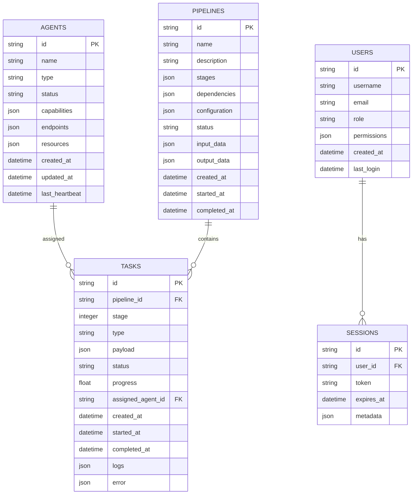

### Cache Strategy

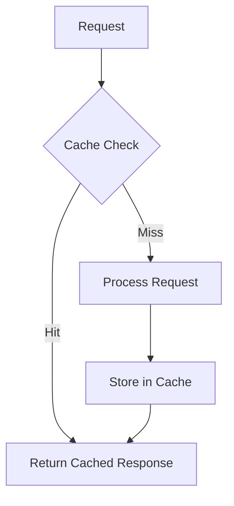

**Cache Layers**:
1. **Redis Cache**: Session data, frequently accessed configurations
2. **In-Memory Cache**: Hot data, agent status, task queues
3. **Database Cache**: Query results, pipeline templates

## Integration Architecture

### Flask API Integration

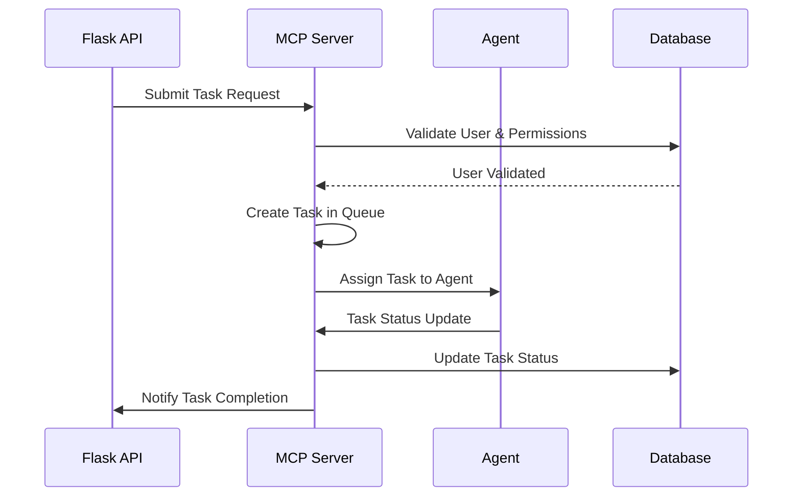

### Agent Communication Flow

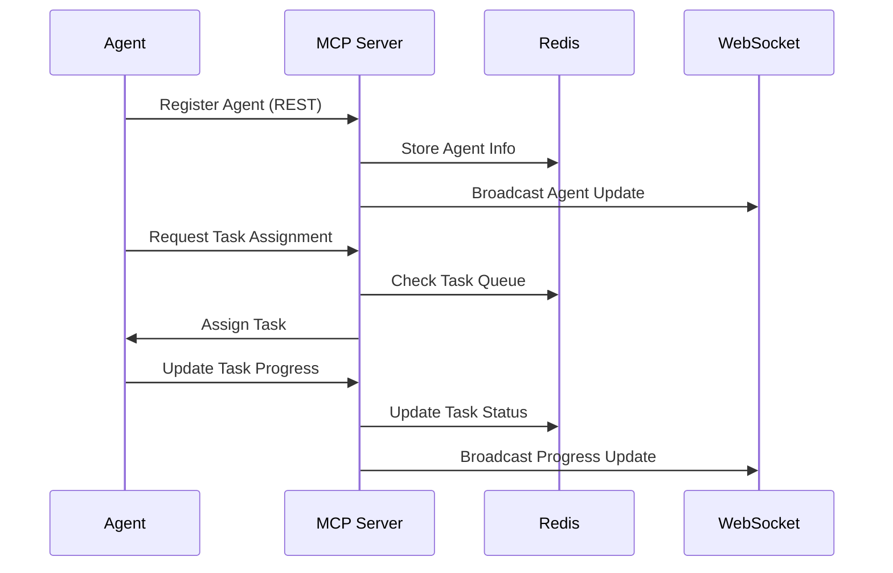

## Security Architecture

### Authentication Flow

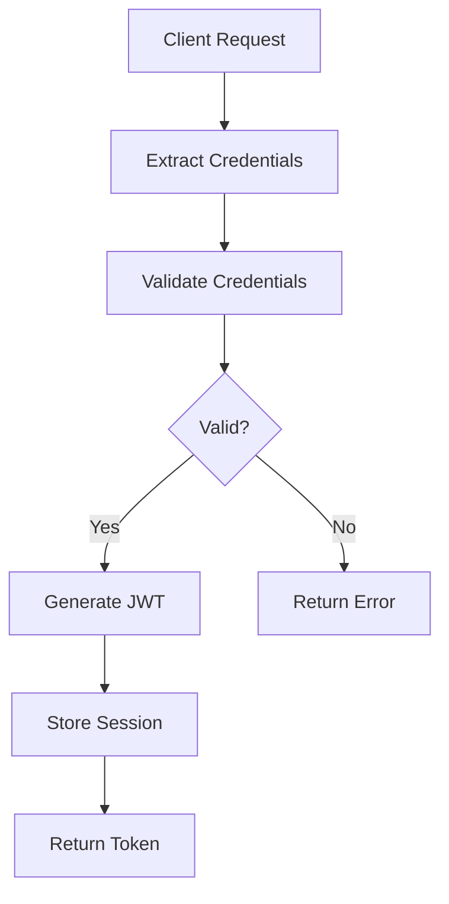

### Authorization Layers

1. **API Level**: JWT token validation
2. **Resource Level**: Role-based permissions
3. **Action Level**: Specific action authorization
4. **Data Level**: Field-level access control

## Performance Architecture

### Scalability Strategy

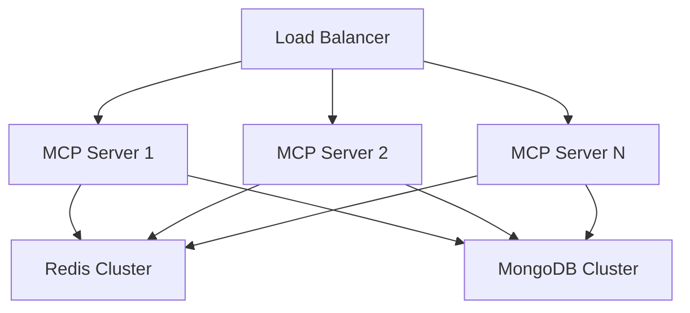

### Performance Optimization

1. **Connection Pooling**: Database and Redis connection reuse
2. **Async Processing**: Non-blocking I/O operations
3. **Load Balancing**: Distribute requests across servers
4. **Caching**: Multi-layer caching strategy
5. **Queue Management**: Priority-based task processing

## Deployment Architecture

### Container Orchestration

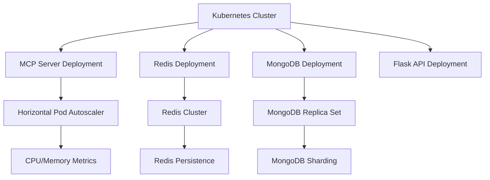

### Environment Configuration

```yaml
# Production Environment
version: '3.8'
services:
  mcp-server:
    image: mcp-server:latest
    replicas: 3
    resources:
      requests:
        memory: "1Gi"
        cpu: "500m"
      limits:
        memory: "2Gi"
        cpu: "1000m"
    environment:
      - MONGODB_URI=mongodb://mongo:27017/mcp_prod
      - REDIS_URL=redis://redis:6379
      - JWT_SECRET=${JWT_SECRET}
      - LOG_LEVEL=INFO
```

## Monitoring Architecture

### Metrics Collection

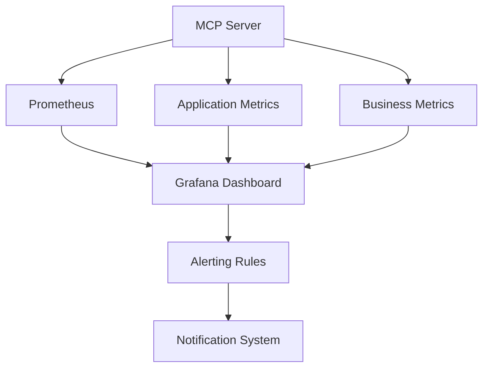

### Logging Strategy

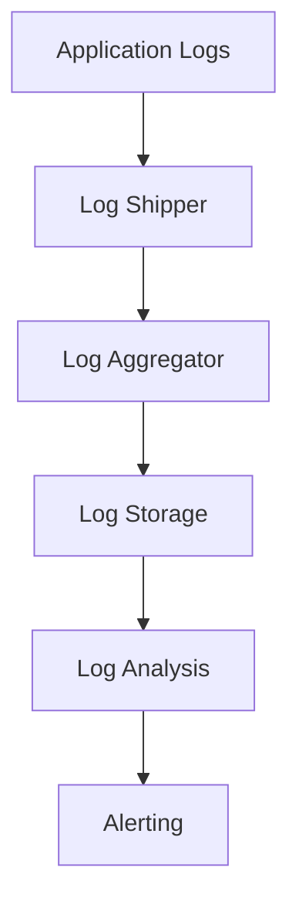

## Error Handling Architecture

### Error Recovery Flow

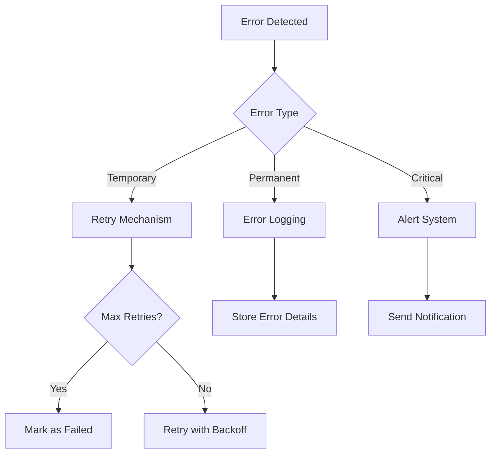

### Circuit Breaker Pattern

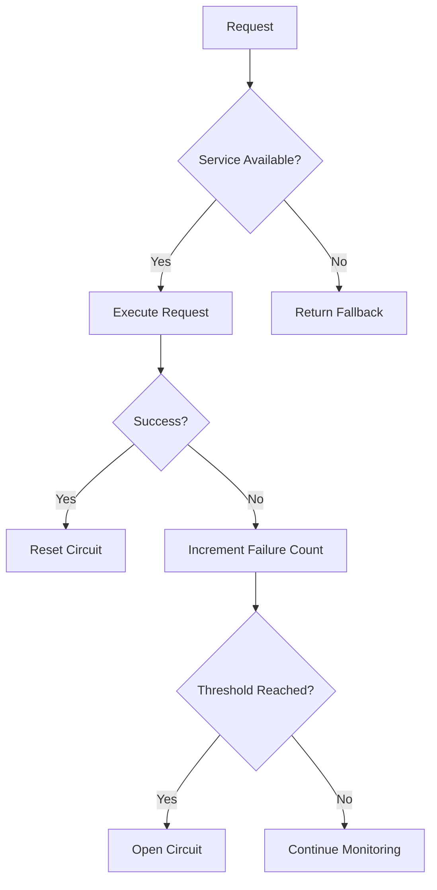

## Extensibility Architecture

### Plugin System

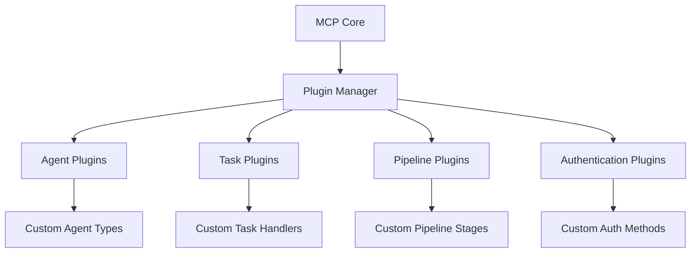

### Configuration Management

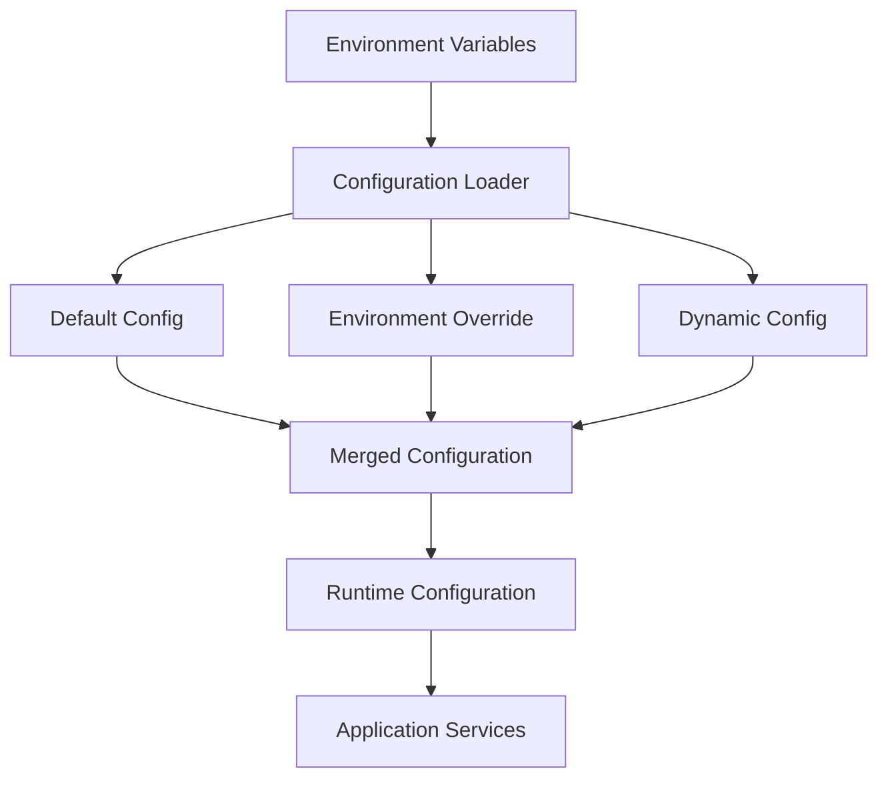

## Quality Attributes

### Performance
- **Response Time**: <100ms for API requests, <50ms for WebSocket messages
- **Throughput**: 1000+ requests per second
- **Latency**: <200ms for task assignment
- **Scalability**: Auto-scaling based on CPU/memory usage

### Reliability
- **Availability**: 99.9% uptime
- **Fault Tolerance**: Automatic recovery from failures
- **Data Consistency**: Strong consistency for critical operations
- **Backup**: Regular database backups and disaster recovery

### Security
- **Authentication**: JWT-based authentication with refresh tokens
- **Authorization**: Role-based access control with fine-grained permissions
- **Encryption**: TLS for all communications, encryption at rest
- **Audit**: Comprehensive audit logging for all operations

### Maintainability
- **Code Quality**: High test coverage, clean architecture
- **Documentation**: Comprehensive API documentation and code comments
- **Monitoring**: Real-time metrics and alerting
- **Deployment**: Automated CI/CD pipeline with blue-green deployments

### Usability
- **API Design**: RESTful APIs with clear documentation
- **WebSocket**: Real-time updates with efficient message routing
- **Error Handling**: Clear error messages and status codes
- **Monitoring**: Intuitive dashboards and reporting tools

## Future Considerations

### Scalability Enhancements
1. **Sharding**: Database sharding for horizontal scaling
2. **Microservices**: Decompose into microservices for independent scaling
3. **Edge Computing**: Deploy edge nodes for global distribution

### Feature Extensions
1. **Multi-tenancy**: Support for multiple organizations
2. **Advanced Scheduling**: Complex scheduling algorithms
3. **Machine Learning**: Predictive task assignment and resource optimization

### Technology Evolution
1. **Kubernetes**: Full Kubernetes-native deployment
2. **Service Mesh**: Istio for advanced service networking
3. **Serverless**: Serverless functions for event-driven processing