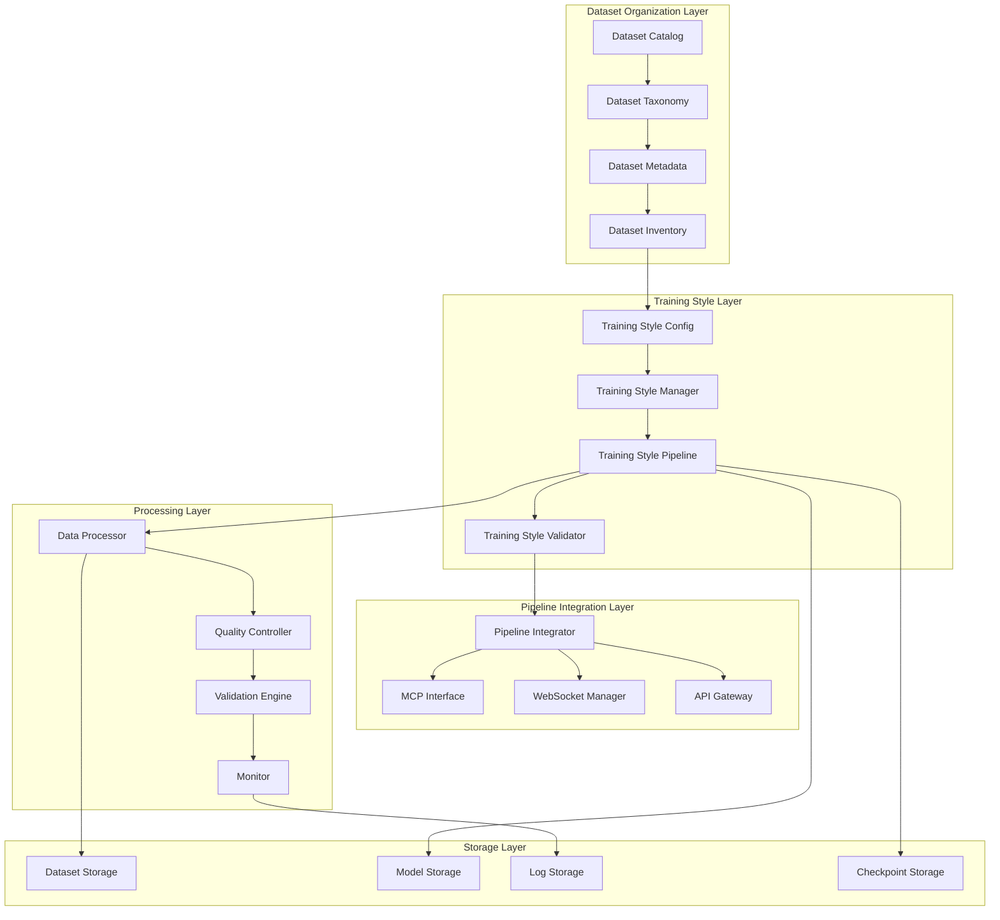
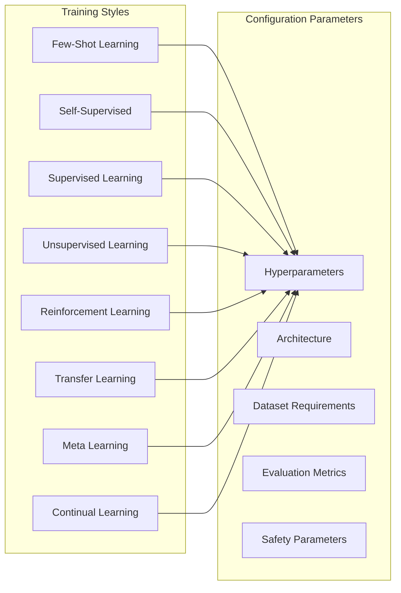
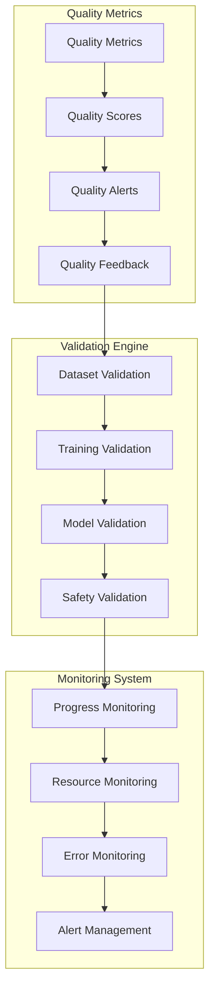

# Dataset Organization and Training Pipeline Architecture

## Overview

This architecture defines a comprehensive system for organizing datasets into categories and implementing different training styles within the Pixelated Empathy AI pipeline. The system integrates with existing MCP (Model Context Protocol) infrastructure, WebSocket real-time communication, and the 6-stage pipeline framework.

## Architecture Goals

- **Modular Dataset Categorization**: Organize datasets by type, domain, and training requirements
- **Flexible Training Styles**: Support multiple training approaches (supervised, unsupervised, few-shot, etc.)
- **Pipeline Integration**: Seamless integration with existing 6-stage pipeline and MCP system
- **Extensibility**: Easy addition of new dataset types and training methodologies
- **Monitoring & Validation**: Comprehensive tracking and quality assurance
- **Security & Compliance**: HIPAA++ compliance with privacy preservation

## System Architecture



## Dataset Categorization System

### Dataset Taxonomy

```mermaid
graph TD
    Dataset[Dataset Root]
    Dataset --> Clinical[Clinical Data]
    Dataset --> Conversational[Conversational Data]
    Dataset --> Therapeutic[Therapeutic Data]
    Dataset --> Synthetic[Synthetic Data]
    Dataset --> Multimodal[Multimodal Data]
    
    Clinical --> MentalHealth[Mental Health Records]
    Clinical --> TherapySessions[Therapy Sessions]
    Clinical --> CrisisData[Crisis Intervention Data]
    
    Conversational --> Empathetic[Empathetic Conversations]
    Conversational --> TherapeuticConv[Therapeutic Conversations]
    Conversational --> Support[Support Interactions]
    
    Therapeutic --> CBT[Cognitive Behavioral Therapy]
    Therapeutic --> DBT[Dialectical Behavior Therapy]
    Therapeutic --> Psychodynamic[Psychodynamic Therapy]
    
    Synthetic --> Generated[AI Generated]
    Synthetic --> Augmented[Data Augmentation]
    Synthetic --> Balanced[Balanced Synthetic]
    
    Multimodal --> TextAudio[Text + Audio]
    Multimodal --> TextVideo[Text + Video]
    Multimodal --> Multilingual[Multilingual Data]
```



### Dataset Categories and Types

#### 1. Clinical Data (`clinical`)
- **Mental Health Records**: Structured clinical assessments, diagnoses, treatment plans
- **Therapy Sessions**: Transcribed therapy sessions with consent
- **Crisis Data**: Crisis intervention conversations and outcomes
- **Metadata**: HIPAA-compliant anonymization, consent tracking, clinical domains

#### 2. Conversational Data (`conversational`)
- **Empathetic Conversations**: General empathetic dialogue patterns
- **Therapeutic Conversations**: Therapy-specific conversation structures
- **Support Interactions**: Peer support and counseling conversations
- **Metadata**: Emotional tone, empathy scores, conversation quality

#### 3. Therapeutic Data (`therapeutic`)
- **CBT Data**: Cognitive Behavioral Therapy techniques and responses
- **DBT Data**: Dialectical Behavior Therapy skills and applications
- **Psychodynamic Data**: Psychodynamic therapy approaches and interpretations
- **Metadata**: Therapy type, technique classification, outcome measures

#### 4. Synthetic Data (`synthetic`)
- **Generated Data**: AI-generated therapeutic conversations
- **Augmented Data**: Enhanced real data with synthetic variations
- **Balanced Data**: Artificially balanced datasets for bias mitigation
- **Metadata**: Generation method, quality scores, authenticity measures

#### 5. Multimodal Data (`multimodal`)
- **Text + Audio**: Transcribed audio with emotional tone analysis
- **Text + Video**: Video sessions with facial expression analysis
- **Multilingual**: Data in multiple languages with cultural context
- **Metadata**: Modality types, language information, cultural context

## Training Style Configuration System

### Training Style Types



#### 1. Few-Shot Learning (`few_shot`)
- **Use Case**: Limited therapeutic data scenarios
- **Parameters**: Shot count, query complexity, support set size
- **Datasets**: Clinical summaries, therapy technique examples
- **Evaluation**: Accuracy on novel therapeutic scenarios

#### 2. Self-Supervised Learning (`self_supervised`)
- **Use Case**: Learning from unlabeled conversational data
- **Parameters**: Masking strategies, contrastive learning temperature
- **Datasets**: Large conversational datasets, forum discussions
- **Evaluation**: Representation quality, downstream task performance

#### 3. Supervised Learning (`supervised`)
- **Use Case**: Standard therapeutic response prediction
- **Parameters**: Learning rate, batch size, epoch count
- **Datasets**: Labeled therapeutic conversations, expert annotations
- **Evaluation**: Response accuracy, therapeutic appropriateness

#### 4. Unsupervised Learning (`unsupervised`)
- **Use Case**: Pattern discovery in therapeutic data
- **Parameters**: Cluster count, dimensionality reduction
- **Datasets**: Unlabeled conversation transcripts, session notes
- **Evaluation**: Cluster coherence, pattern meaningfulness

#### 5. Reinforcement Learning (`reinforcement`)
- **Use Case**: Optimizing therapeutic response strategies
- **Parameters**: Reward function, exploration rate, policy updates
- **Datasets**: Conversation outcomes, therapeutic success metrics
- **Evaluation**: Conversation quality, therapeutic outcomes

#### 6. Transfer Learning (`transfer_learning`)
- **Use Case**: Adapting general models to therapeutic domains
- **Parameters**: Fine-tuning rate, layer freezing, domain adaptation
- **Datasets**: Pre-trained models, therapeutic domain data
- **Evaluation**: Domain adaptation quality, therapeutic relevance

#### 7. Meta Learning (`meta_learning`)
- **Use Case**: Learning to learn therapeutic patterns
- **Parameters**: Meta-learning rate, task distribution, adaptation steps
- **Datasets**: Diverse therapeutic scenarios, multi-task datasets
- **Evaluation**: Adaptation speed, cross-task performance

#### 8. Continual Learning (`continual_learning`)
- **Use Case**: Continuous model updates with new therapeutic data
- **Parameters**: Memory buffer size, regularization strength, forgetting rate
- **Datasets**: Streaming therapeutic data, evolving conversation patterns
- **Evaluation**: Retention of previous knowledge, adaptation to new patterns

## Data Flow Architecture

### Pipeline Stages Integration


### Detailed Data Flow

1. **Dataset Ingestion**: Raw datasets are ingested with metadata extraction
2. **Categorization**: Automatic classification based on content analysis and metadata
3. **Validation**: Quality checks, format validation, and compliance verification
4. **Preprocessing**: Cleaning, normalization, and augmentation based on category
5. **Bias Detection**: Automated bias analysis with demographic and content balancing
6. **Standardization**: Format conversion and schema alignment
7. **Training Style Selection**: Dynamic selection based on dataset characteristics and goals
8. **Training Execution**: Model training with style-specific configurations
9. **Evaluation**: Comprehensive assessment including safety and therapeutic metrics
10. **Storage**: Secure storage with versioning and audit trails

## Integration Points

### MCP (Model Context Protocol) Integration

```typescript
interface DatasetTrainingMCP {
  // Dataset management
  registerDataset(category: string, metadata: DatasetMetadata): Promise<DatasetID>
  categorizeDataset(datasetId: DatasetID, taxonomy: TaxonomyNode): Promise<void>
  getDatasetRecommendations(requirements: TrainingRequirements): Promise<DatasetID[]>
  
  // Training style management
  configureTrainingStyle(style: TrainingStyle, config: TrainingConfig): Promise<TrainingID>
  selectOptimalStyle(datasetId: DatasetID, goals: TrainingGoals): Promise<TrainingStyle>
  validateTrainingConfiguration(config: TrainingConfig): Promise<ValidationResult>
  
  // Pipeline integration
  executeTrainingPipeline(datasetId: DatasetID, style: TrainingStyle): Promise<PipelineID>
  monitorTrainingProgress(pipelineId: PipelineID): Promise<ProgressStream>
  getTrainingResults(pipelineId: PipelineID): Promise<TrainingResults>
}
```

### WebSocket Real-time Integration

```typescript
interface DatasetTrainingWebSocket {
  // Real-time events
  onDatasetCategorized: (event: DatasetCategorizedEvent) => void
  onTrainingStyleSelected: (event: StyleSelectedEvent) => void
  onTrainingProgress: (event: TrainingProgressEvent) => void
  onTrainingCompleted: (event: TrainingCompletedEvent) => void
  onValidationResult: (event: ValidationResultEvent) => void
  
  // Bidirectional communication
  requestDatasetInfo: (datasetId: DatasetID) => Promise<DatasetInfo>
  requestTrainingStyles: () => Promise<TrainingStyle[]>
  requestPipelineStatus: (pipelineId: PipelineID) => Promise<PipelineStatus>
}
```

### API Gateway Integration

```typescript
interface DatasetTrainingAPI {
  // REST endpoints
  POST /api/datasets/categorize
  GET /api/datasets/categories
  GET /api/datasets/{id}/metadata
  POST /api/training/styles/configure
  GET /api/training/styles/{style}/config
  POST /api/training/execute
  GET /api/training/{id}/status
  GET /api/training/{id}/results
  GET /api/pipeline/{id}/progress
}
```

## Monitoring and Validation Components

### Quality Control System



### Validation Components

1. **Dataset Validation**
   - Format compliance checking
   - Content quality assessment
   - Bias and fairness evaluation
   - Privacy and consent verification

2. **Training Validation**
   - Hyperparameter validation
   - Resource requirement checking
   - Safety parameter verification
   - Configuration consistency

3. **Model Validation**
   - Performance metrics evaluation
   - Therapeutic appropriateness assessment
   - Safety and ethics compliance
   - Bias detection and mitigation

4. **Safety Validation**
   - Crisis content detection
   - Therapeutic response appropriateness
   - Demographic balance assessment
   - Privacy preservation verification

## Extensibility Framework

### Plugin Architecture

```typescript
interface DatasetPlugin {
  name: string
  version: string
  category: DatasetCategory
  supportedFormats: string[]
  
  detectCategory(content: any, metadata: Metadata): Promise<CategoryConfidence>
  extractMetadata(content: any): Promise<Metadata>
  validateContent(content: any): Promise<ValidationResult>
  preprocessContent(content: any): Promise<ProcessedContent>
}

interface TrainingStylePlugin {
  name: string
  version: string
  style: TrainingStyle
  requirements: TrainingRequirements
  
  configureTraining(config: TrainingConfig): Promise<TrainingConfiguration>
  executeTraining(dataset: Dataset, config: TrainingConfiguration): Promise<TrainingResults>
  evaluateResults(results: TrainingResults): Promise<EvaluationResults>
  optimizeHyperparameters(dataset: Dataset): Promise<HyperparameterConfig>
}
```

### Extension Points

1. **Dataset Type Extensions**: Add new dataset categories and processing logic
2. **Training Style Extensions**: Implement new training methodologies
3. **Validation Extensions**: Add custom validation and quality checks
4. **Monitoring Extensions**: Integrate new monitoring and alerting systems
5. **Storage Extensions**: Support new storage backends and formats

## Security and Compliance

### Privacy Preservation

- **Data Anonymization**: Automatic PII removal and anonymization
- **Consent Management**: Tracking and verification of data usage consent
- **Access Control**: Role-based access to datasets and training configurations
- **Audit Logging**: Comprehensive audit trails for all operations
- **Encryption**: End-to-end encryption for data in transit and at rest

### HIPAA++ Compliance

- **Data Minimization**: Only necessary data is processed and stored
- **Purpose Limitation**: Data used only for specified therapeutic purposes
- **Transparency**: Clear documentation of data usage and processing
- **Accountability**: Comprehensive logging and audit capabilities
- **Patient Rights**: Support for data access, correction, and deletion requests

## Configuration Management

### Environment-based Configuration

```yaml
# config/dataset_training.yaml
dataset_training:
  categories:
    clinical:
      enabled: true
      validation_strict: true
      privacy_level: maximum
    conversational:
      enabled: true
      augmentation_enabled: true
    therapeutic:
      enabled: true
      expert_validation_required: true
  
  training_styles:
    few_shot:
      enabled: true
      max_shots: 10
      query_complexity: medium
    self_supervised:
      enabled: true
      masking_ratio: 0.15
      contrastive_temperature: 0.07
    supervised:
      enabled: true
      validation_split: 0.2
      test_split: 0.1
  
  security:
    encryption_enabled: true
    audit_logging: true
    access_control: role_based
    data_retention_days: 365
  
  monitoring:
    metrics_enabled: true
    alerting_enabled: true
    webhook_notifications: true
    progress_updates: true
```

## Deployment Architecture

### Container-based Deployment

```dockerfile
# Dockerfile for dataset training service
FROM python:3.11-slim

WORKDIR /app

# Install dependencies
COPY requirements.txt .
RUN pip install --no-cache-dir -r requirements.txt

# Copy application code
COPY ai/dataset_pipeline/ ./ai/dataset_pipeline/
COPY config/ ./config/

# Set environment variables
ENV PYTHONPATH=/app:$PYTHONPATH
ENV DATASET_TRAINING_CONFIG=/app/config/dataset_training.yaml

# Run the service
CMD ["python", "-m", "ai.dataset_pipeline.training_orchestrator"]
```

### Kubernetes Deployment

```yaml
apiVersion: apps/v1
kind: Deployment
metadata:
  name: dataset-training-service
spec:
  replicas: 3
  selector:
    matchLabels:
      app: dataset-training-service
  template:
    metadata:
      labels:
        app: dataset-training-service
    spec:
      containers:
      - name: dataset-training
        image: pixelated-empathy/dataset-training:latest
        ports:
        - containerPort: 8080
        env:
        - name: DATABASE_URL
          valueFrom:
            secretKeyRef:
              name: dataset-training-secrets
              key: database-url
        - name: REDIS_URL
          valueFrom:
            secretKeyRef:
              name: dataset-training-secrets
              key: redis-url
        resources:
          requests:
            memory: "2Gi"
            cpu: "1000m"
          limits:
            memory: "4Gi"
            cpu: "2000m"
```

## Performance Optimization

### Caching Strategy

- **Dataset Metadata Cache**: Redis-based caching for dataset metadata
- **Training Configuration Cache**: In-memory caching of training configurations
- **Validation Result Cache**: Caching of expensive validation operations
- **Model Artifact Cache**: Efficient storage and retrieval of trained models

### Scalability Considerations

- **Horizontal Scaling**: Multiple training workers for parallel processing
- **Queue-based Processing**: Asynchronous processing with job queues
- **Resource Management**: Dynamic resource allocation based on workload
- **Load Balancing**: Intelligent distribution of training requests

## Testing Strategy

### Unit Testing
- Dataset categorization logic
- Training style configuration validation
- Pipeline stage execution
- Integration point testing

### Integration Testing
- End-to-end pipeline execution
- MCP integration testing
- WebSocket communication testing
- API endpoint testing

### Performance Testing
- Large dataset processing
- Concurrent training execution
- Resource utilization monitoring
- Scalability testing

## Monitoring and Observability

### Metrics Collection

```typescript
interface DatasetTrainingMetrics {
  // Dataset metrics
  datasets_processed: Counter
  datasets_categorized: Counter
  dataset_processing_time: Histogram
  dataset_quality_score: Gauge
  
  // Training metrics
  training_requests: Counter
  training_completed: Counter
  training_failed: Counter
  training_duration: Histogram
  training_resource_usage: Histogram
  
  // Pipeline metrics
  pipeline_executions: Counter
  pipeline_stage_duration: Histogram
  pipeline_errors: Counter
  pipeline_throughput: Gauge
  
  // System metrics
  system_memory_usage: Gauge
  system_cpu_usage: Gauge
  system_disk_usage: Gauge
  system_network_io: Counter
}
```

### Alerting Rules

- High training failure rate
- Dataset quality degradation
- Resource exhaustion
- Security violations
- Compliance breaches

## Conclusion

This architecture provides a comprehensive, scalable, and secure framework for organizing datasets into categories and implementing different training styles within the Pixelated Empathy AI ecosystem. The modular design ensures extensibility while maintaining integration with existing systems and compliance requirements.

The system supports:
- Multiple dataset categories with sophisticated taxonomy
- Flexible training style configurations
- Seamless integration with MCP and WebSocket systems
- Comprehensive monitoring and validation
- HIPAA++ compliance and security
- Extensible plugin architecture
- Container-based deployment

This architecture enables the project to efficiently process diverse therapeutic datasets and apply appropriate training methodologies while maintaining high standards for safety, privacy, and therapeutic appropriateness.